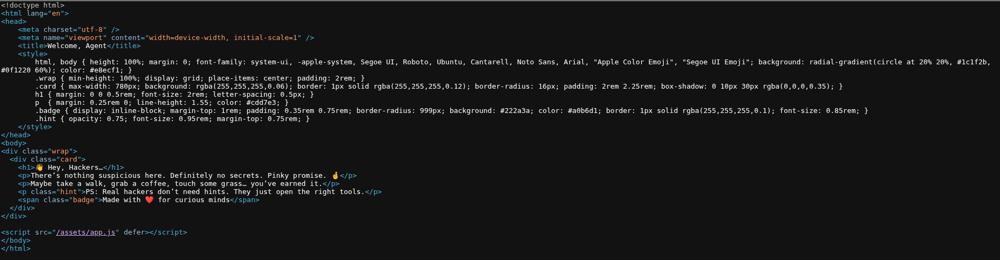
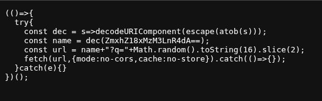

# Baby Steps - CTF Writeup

## Challenge Overview
This is a beginner-level web exploitation challenge that involves analyzing source code and decoding encoded data.

## Solution Process

### Step 1: Initial Analysis

First, I examined the web application by viewing the source code in the browser's developer tools (see `source_code.png`). This initial reconnaissance revealed the application structure and exposed a critical reference to an `app.js` file located at `/asset/app.js`.

### Step 2: Application Analysis


By analyzing the app.js file, I was able to identify key components and understand how the application processes requests.

### Step 3: Finding the Encoded Data
Through source code analysis, I discovered a base64-encoded string that appeared to contain important information. The encoded string was:
```
ZmxhZ18xMzM3LnR4dA==
```

### Step 4: Decoding the Information
I decoded the base64 string using the following command:
```bash
echo "ZmxhZ18xMzM3LnR4dA==" | base64 -d
```
I got the result:
```flag_1337.txt
```

### Step 5: Obtaining the Flag
The base64 decoding revealed the filename `flag_1337.txt`. To get the actual flag, I visited:
```
http://68.219.177.187:8006/flag_1337.txt
```

This provided the flag for the challenge.

## Key Learning Points
- Always check the source code of web applications for hidden information
- Base64 encoding is commonly used to obfuscate data in CTF challenges
- Simple encoding doesn't provide security - it's just obscurity
- Decoded information often points to specific files or endpoints

## Tools Used
- Web browser developer tools
- Base64 decoder (command line)
- Source code analysis

## Flag
`SecurinetsENIT{B4BY_ST3PS!}`

---

